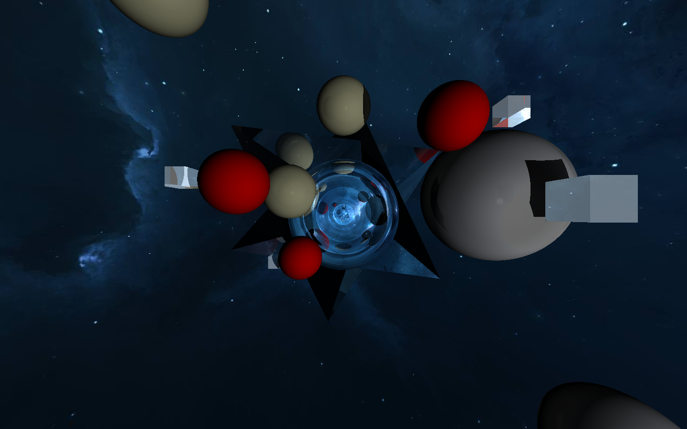

# RayTracer Blackhole   
  
- [20 puntos] Criterio subjetivo. Por qué tan compleja sea su escena  
- [30 puntos] Criterio subjetivo. por qué tan visualmente atractiva sea su escena  
  
- [5 puntos] por cada material diferente que implementen, para un máximo de 5  
- [10 puntos] por implementar refracción en al menos uno de sus materiales  
- [5 puntos] por implementar reflexión en al menos uno de sus materiales  
- [30 puntos] por implementar figuras geométricas distintas a esferas, cubos, rectangulos y planos  
- [5 puntos] por implementar un envmap  
  
Para este proyecto se intentó simular un "Agujero negro" o algo esapcial que demostrara caos.  
Se colocó mucha refraccion y refleccion al centro del agujero negro para simular el efecto de uno real.  
Hay 3 "tipos" de planetas, venus, mercurio y gigantes gaseosos. Los cubos al lado de algunos planetas simulan un "satélite" pero no notan tan bien.
El Resultado fue el Siguiente:  
  

PD: Me esforcé un montón el poder hacer este proyecto, le dediqué más horas de las que me hubieran gustado, sé que no es muy estetico, pero no tengo creatividad visual o de hacer cosas visuales, hice lo mejor que pude.  
